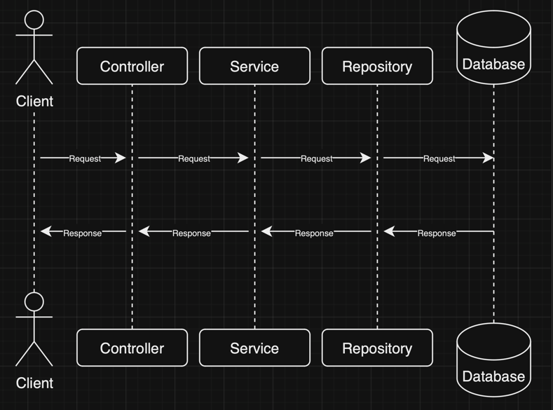
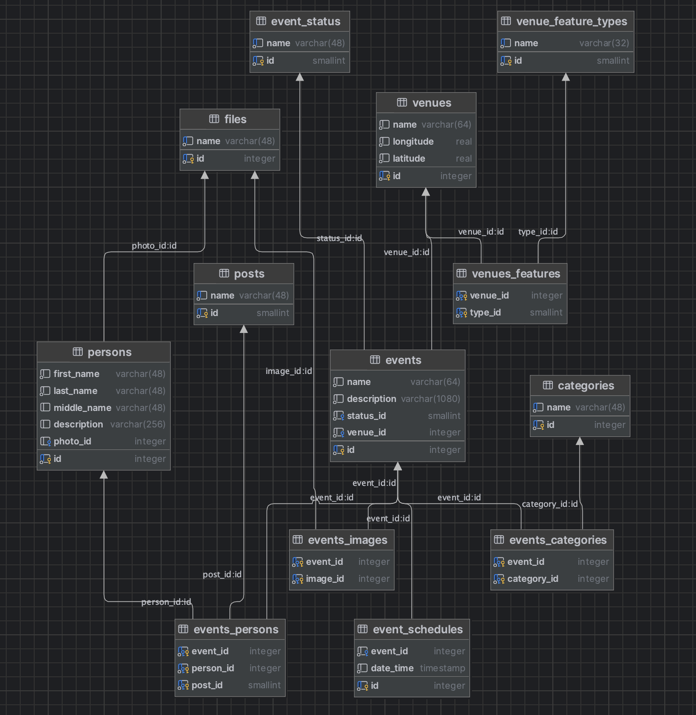

# MTC Live API

You can access Swagger and see all available endpoints by visiting http://localhost:10028/mtc-live/v1.0/swagger-ui/index.html

## Environments

To run this application you need to create `.env` file in root directory with next environments:

- `POSTGRES_HOST` - host of Postgresql database
- `POSTGRES_USERNAME` - username for Postgresql database
- `POSTGRES_PASSWORD` - password for Postgresql database
- `POSTGRES_DATABASE` - name of Postgresql database
- `POSTGRES_SCHEMA` - name of Postgresql schema

## Run app
1. Run the [script](src/main/resources/schemes.sql) for your database
2. Create jar file with the command ```./gradlew build```
3. Run file ```java -jar build/libs/live-0.0.1-SNAPSHOT.jar```


## Sequence diagram


## Database diagram

